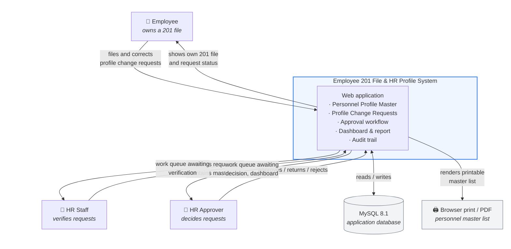

# 1. System Context Diagram

Scope: the MVP as actually built. There is no external system integration —
the only "external" dependency is the MySQL database the application owns.

## Interactions

| Actor | What they do | What they get back |
| --- | --- | --- |
| Employee | Files a Profile Change Request against their own 201 file; corrects and resubmits returned requests | Their own personnel record and the status of their own requests only |
| HR Staff | Verifies submitted requests against supporting documents; maintains Personnel, Office and Position master data | Queue of requests awaiting verification; full personnel roster; dashboard |
| HR Approver | Approves, returns or rejects verified requests; maintains master data; deletes and restores records | Queue of requests awaiting decision; dashboard; printable master list |

A request cannot reach the HR Approver until HR Staff has verified it. That
gate is what separates the two HR roles.

Every write carries the acting user with it: each record stores the user who
created it and the user who last changed it, and deletion hides a record rather
than destroying it. Restoring one is the HR Approver's call alone.
