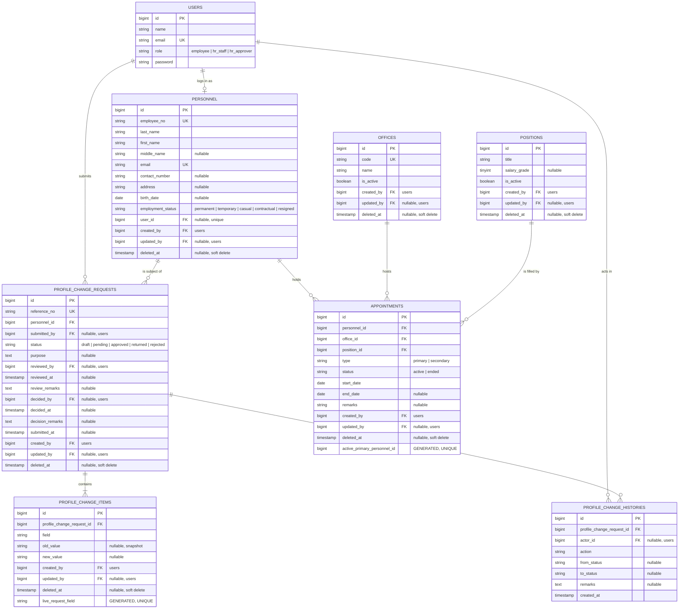

# 2. Entity Relationship Diagram

This diagram matches the migrations in `database/migrations/` exactly.

Every table except `users` and `profile_change_histories` carries the same
three ownership columns — `created_by`, `updated_by` and `deleted_at`. They are
shown on each entity below because the ERD is meant to match the migrations,
but the rule behind them is one rule, described under
[Record ownership and soft deletes](#record-ownership-and-soft-deletes).



## Cardinalities that carry business meaning

| Relationship | Cardinality | Why |
| --- | --- | --- |
| `personnel` → `appointments` | 1 : many | An employee accumulates appointment history over time |
| `personnel` → **active primary** `appointments` | **1 : at most 1** | The core business rule, enforced by a unique index — see below |
| `users` → `personnel` | 1 : 0..1 | HR can encode a personnel record before the person has a login |
| `profile_change_requests` → `profile_change_items` | 1 : 1..many | A request with no lines cannot be submitted |
| `profile_change_requests` → `profile_change_histories` | 1 : many | Append-only audit trail |

## How the core rule is enforced in the schema

MySQL has no partial indexes, so `appointments` carries a generated column
that holds `personnel_id` only when the row is both `primary` and `active`,
and `NULL` otherwise:

```sql
active_primary_personnel_id BIGINT UNSIGNED GENERATED ALWAYS AS (
    CASE
        WHEN deleted_at IS NULL AND type = 'primary' AND status = 'active'
        THEN personnel_id
    END
) VIRTUAL

CREATE UNIQUE INDEX appointments_one_active_primary_per_personnel
    ON appointments (active_primary_personnel_id);
```

MySQL allows unlimited `NULL`s in a unique index, so secondary, ended and
soft-deleted appointments are unconstrained while a second *active primary*
row is impossible. `App\Models\Appointment` guards the same rule in PHP so the
user sees a readable message rather than an integrity-constraint error.

The `deleted_at IS NULL` arm matters: without it a soft-deleted appointment
would go on holding the employee's only primary slot, and the row would block
its own replacement.

## Record ownership and soft deletes

| Column | Type | Meaning |
| --- | --- | --- |
| `created_by` | `foreignId` → `users.id`, **required** | Who encoded the record |
| `updated_by` | `foreignId` → `users.id`, nullable | Who last changed it; `NULL` until it is changed |
| `deleted_at` | `timestamp`, nullable | Set by Laravel `SoftDeletes` |

Both user columns are written by `App\Models\Concerns\TracksOwnership` from
the authenticated user. Neither appears in any Filament form and neither is
mass-assignable, so `created_by` cannot be chosen or spoofed from a form
payload — see `tests/Feature/OwnershipAndSoftDeleteTest.php`.

`profile_change_histories` is deliberately excluded. It is a purely
system-generated, append-only audit log that already names its `actor_id`, and
an audit trail that can be deleted is not an audit trail.

### Soft deletes and the unique indexes

A unique index counts soft-deleted rows, so the two business-rule indexes are
both built on generated columns that go `NULL` once the row is trashed:

| Table | Generated column | Rule it enforces |
| --- | --- | --- |
| `appointments` | `active_primary_personnel_id` | One active primary appointment per employee |
| `profile_change_items` | `live_request_field` | One line per field per request |

Without this, deleting a request line and adding the same field again would
collide with the row that is no longer visible anywhere in the application.
