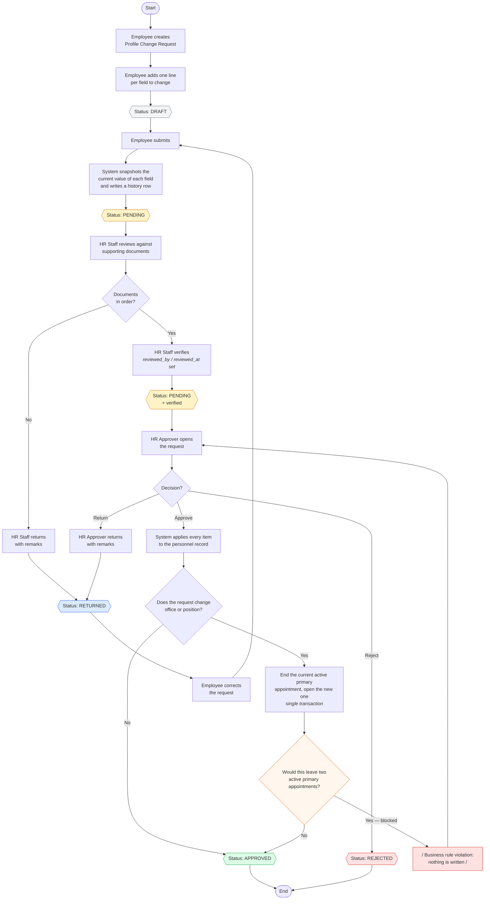

# 3. Process Flow Diagram

End-to-end flow of a Profile Change Request, including the alternate paths.

## Decision points

| # | Decision | Taken by | Outcomes |
| --- | --- | --- | --- |
| 1 | Are the supporting documents in order? | HR Staff | Verify → on to the approver; Return → back to the employee |
| 2 | Approve, return or reject? | HR Approver | Approve applies the changes; Return reopens it for the employee; Reject ends it |
| 3 | Would this create a second active primary appointment? | System | Blocked with a message; nothing is written |

## Status transitions

| From | Action | To | Who |
| --- | --- | --- | --- |
| — | Create | Draft | Employee |
| Draft | Submit | Pending | Employee |
| Pending | Verify | Pending *(verified)* | HR Staff |
| Pending | Return for revision | Returned | HR Staff or HR Approver |
| Pending *(verified)* | Approve | Approved | HR Approver |
| Pending *(verified)* | Reject | Rejected | HR Approver |
| Returned | Resubmit | Pending *(verification reset)* | Employee |

Approved and Rejected are terminal. Resubmitting a returned request clears the
earlier verification, so review starts over rather than carrying a stale
approval forward.
