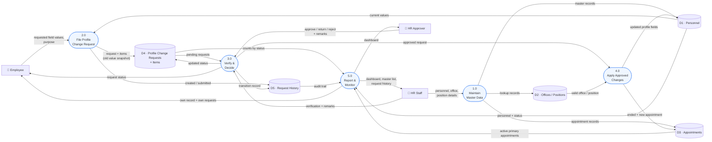

# 4. Data Flow Diagram — Level 0

## Processes

| # | Process | Main input | Main output | Data stores |
| --- | --- | --- | --- | --- |
| 1.0 | Maintain Master Data | Personnel, office, position details from HR | Authoritative master records | D1, D2, D3 |
| 2.0 | File Profile Change Request | Requested values + purpose from the employee | Draft/submitted request with an old-value snapshot | D1 (read), D4, D5 |
| 3.0 | Verify & Decide | Verification and decision with remarks | Updated status, transition record, notice to employee | D4, D5 |
| 4.0 | Apply Approved Changes | An approved request | Updated personnel record; ended + new appointment | D1, D2 (read), D3 |
| 5.0 | Report & Monitor | Stored records | Dashboard, printable master list, audit trail | D1, D3, D4, D5 (read) |

Process 4.0 is the only path that writes to Appointments as part of the
workflow, and it always goes through the transfer routine — which is why the
one-active-primary rule cannot be sidestepped by approving a request.

Every write into D1–D4 also stamps the acting user onto the row (`created_by`
on insert, `updated_by` on change), and deletion writes `deleted_at` rather
than removing the row, so nothing in the diagram above is ever a destructive
flow. D5 is append-only and is never written by any process other than 2.0 and
3.0.
