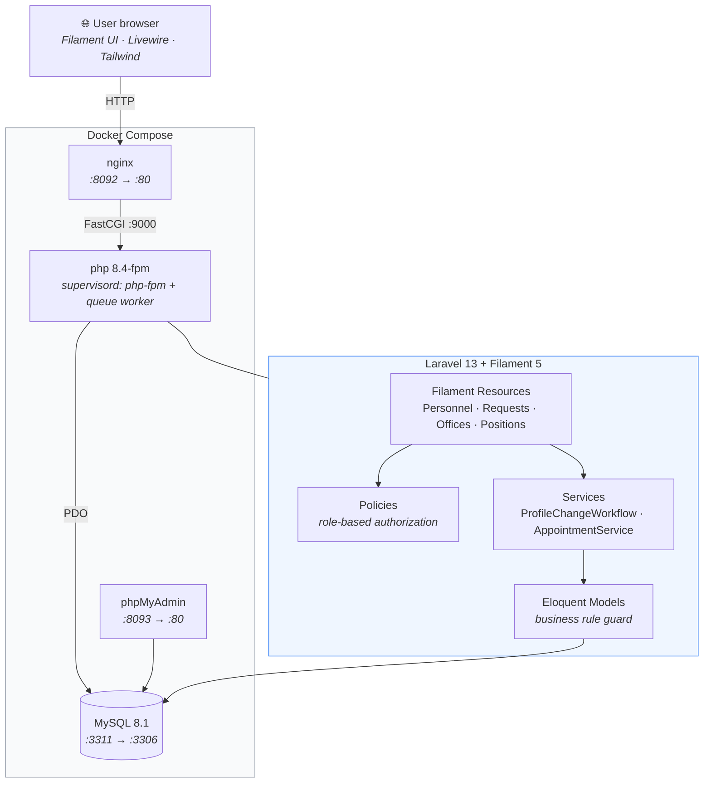

# 5. Application Architecture (bonus)

## Where each concern lives

| Concern | Location |
| --- | --- |
| Screens, forms, tables, actions | `app/Filament/Resources/**` |
| Who may do what | `app/Policies/**` |
| Status transitions + audit writes | `app/Services/ProfileChangeWorkflow.php` |
| Appointment transfer | `app/Services/AppointmentService.php` |
| Core business rule (app layer) | `app/Models/Appointment.php` — `booted()` |
| Core business rule (database layer) | `database/migrations/2026_09_18_000005_*` — generated column + unique index |
| Editable profile fields + display | `app/Support/ProfileField.php` |
| Dashboard | `app/Filament/Widgets/**` |
| Printable report | `app/Http/Controllers/Reports/**`, `resources/views/reports/**` |

Every status change goes through `ProfileChangeWorkflow`, so the audit trail
cannot drift out of step with the request. No file storage or external APIs are
used.
